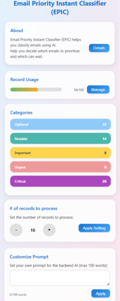
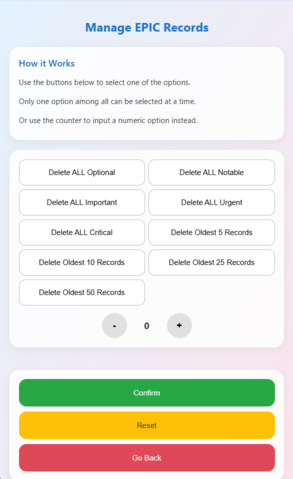
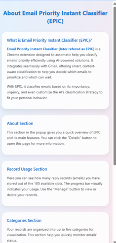

# **Email Priority Instant Classifier (EPIC)**  
A Chrome extension designed to automatically classify your Gmail emails' priority using Gemini. EPIC helps you identify which emails to prioritize and which can wait, saving you time and improving your workflow.  

---

## **What is EPIC?**  
EPIC (**Email Priority Instant Classifier**) is a **Chrome Extension** that integrates seamlessly with **Gmail** to provide **context-aware email classification**.  
With EPIC, you can:  
✔ Automatically classify emails based on **importance** and **urgency**  
✔ Customize the AI's classification strategy to match your personal workflow  
✔ Visualize email categories and manage stored records  

---

### **Key Features**  
- **About Section**  
  Provides an overview of EPIC and its main features. Click **"Details"** to learn more.  

- **Record Usage Section**  
  Displays how many email reply records you’ve stored (max **100** slots). Includes a **progress bar** for quick usage tracking and a **Manage** button to delete or view records.  

- **Categories Section**  
  Organizes records into **five categories** for better visualization and status monitoring.  

- **Customize Prompt Section**  
  Lets you **customize the AI’s classification strategy** by adding your own prompt (up to **100 words**). Apply changes instantly with or without re-classifying existing emails.  

---

### **Screenshots**

Here’s a quick look at the Email Priority Instant Classifier (EPIC) in action:

<div style="display: flex; gap: 10px; flex-wrap: wrap;">

  <div>
    <p align="center"><strong>Popup Overview</strong></p>
    
  </div>

  <div>
    <p align="center"><strong>Manage Record Page</strong></p>
    
  </div>

  <div>
    <p align="center"><strong>Learn More Page</strong></p>
    
  </div>

</div>

---

## **Tech Stack**  
**Frontend:**  
- HTML, CSS, JavaScript (**Chrome Extension**)  

**Backend:**  
- **FastAPI** (Python backend framework)  
- **Gemini API** (AI-powered classification)  
- **MongoDB** (Database for storing records and custom prompts)

**Infrastructure & Deployment:**  
- **Docker** (Containerization)  
- **Google Cloud Run** (Backend hosting)  
- **GitHub Actions** (CI/CD pipeline for backend)  

---

## **Project Structure**  
```
root/
├── backend/ # FastAPI backend
│ ├── main.py # API entry point
│ ├── requirements.txt # Python dependencies
│ ├── env.example # Put your env here or set environment variable
│ └── ...
├── extension/ # Chrome extension (frontend)
│ ├── manifest.json
│ ├── popup.html
│ ├── popup.js
│ ├── style.css
│ └── ...
├── deploy/
│ └── cloudrun.Dockerfile # Docker configuration
├── test/
│ └── test_routes.py
```

---

## **How to Run Locally**  

### **Prerequisites**  
- Python 3.11+ 
- MongoDB
- Gemini API Key

---

### **1. Clone the Repository**  
```bash
git clone https://github.com/your-username/epic-extension.git
cd epic-extension
```

### **2. Run Backend Locally**  
Create a virtual environment and install dependencies (Anaconda recommended):
```bash
cd backend
conda create --name your_choice python=3.11
conda activate your_choice
pip install -r requirements.txt
```

Start the FastAPI server:
```bash
cd ../
uvicorn backend.main:app --reload --port 8000
```

### **3. Load Chrome Extension**
1. Open Chrome → chrome://extensions/
2. Enable Developer Mode
3. Click Load unpacked → Select the extension/ folder

---

## **CI/CD with GitHub Actions**
The backend uses GitHub Actions for continuous integration and deployment. The workflow:
Runs tests & lint checks on every push to the backend folder,
builds the Docker image, and
automatically deploys to Google Cloud Run when merging to main.
Workflow file: .github/workflows/backend_ci.yml, .github/workflows/backend_cd.yml

---

## **Fork & Star**

If you find this project useful or interesting, feel free to:  

- **Fork** it to your own GitHub account to experiment, improve, or build upon it  
- **Give it a ⭐ Star** to show your support and help others discover it  

Every star and fork is really appreciated! It helps more people discover EPIC and motivates me to keep improving and adding features.

---

## **Contributing**

Warmly welcome to all meaningful contributions! Whether it’s:  
- Adding new useful features,  
- Making existing functions more reliable or secure,  
- Improving the overall design of the extension,  

…your efforts are appreciated.  

Here’s how to contribute:  

1. **Fork** the repository  
2. Create a new **branch** for your feature, improvement, or bugfix  
3. Make your changes with clear, descriptive **commit messages**  
4. **Push** your branch to your fork  
5. Open a **Pull Request** to this repository  

Please ensure that your contributions **adhere to the GPLv3 license**, meaning any modifications or enhancements you submit will also be open-source under GPLv3.  

Excited to see your ideas and improvements—thank you for helping make EPIC even better!

---

## **License**

This project is licensed under the **GNU General Public License v3.0 (GPLv3)**.  
You are free to **use, modify, and distribute** this software, but any derivative works **must also be released under GPLv3**.  
See the [LICENSE](./LICENSE) file for full details.

--- 

## **Author**
### **ITing Liu**

---

## **Third-Party Services & Dependencies**
This project uses the following third-party services, which are subject to their own licenses and terms:
- **Gemini API** – AI-powered email classification.
- **MongoDB / MongoDB Atlas** – storing records and custom prompts.
- Other dependencies are listed in `requirements.txt` and follow their own licenses.
